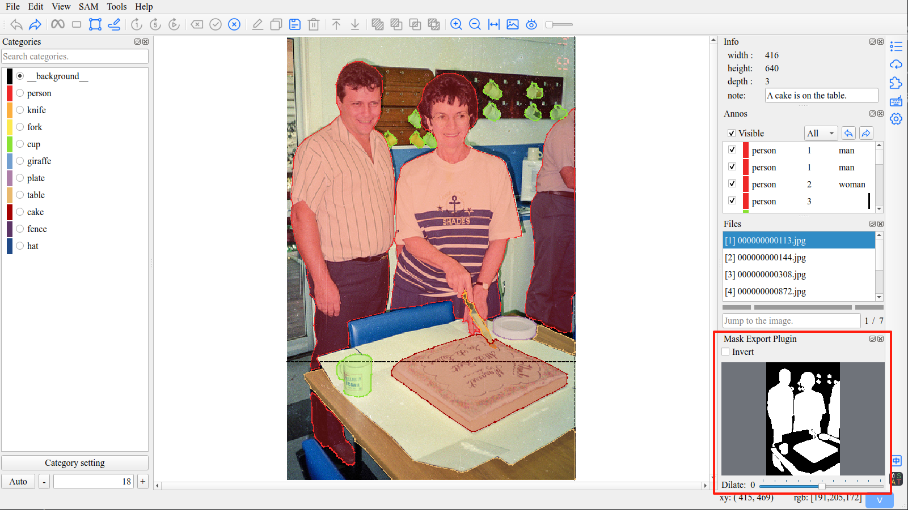

# ISAT插件 - mask导出

这是一个[ISAT](https://github.com/yatengLG/ISAT_with_segment_anything)的插件开发示例。

仅使用157行代码，开发一个带界面的ISAT插件，使ISAT支持mask导出功能。



## 功能

* 跟随标注操作，实时显示mask
* 支持mask反转
* 支持mask膨胀/腐蚀
* 保存标注的同时，保存mask图像

## 安装与使用

### 安装

```shell
pip install isat-plugin-mask-export
```

### 使用

- 运行isat
- 插件界面，激活MaskExportPlugin即可

